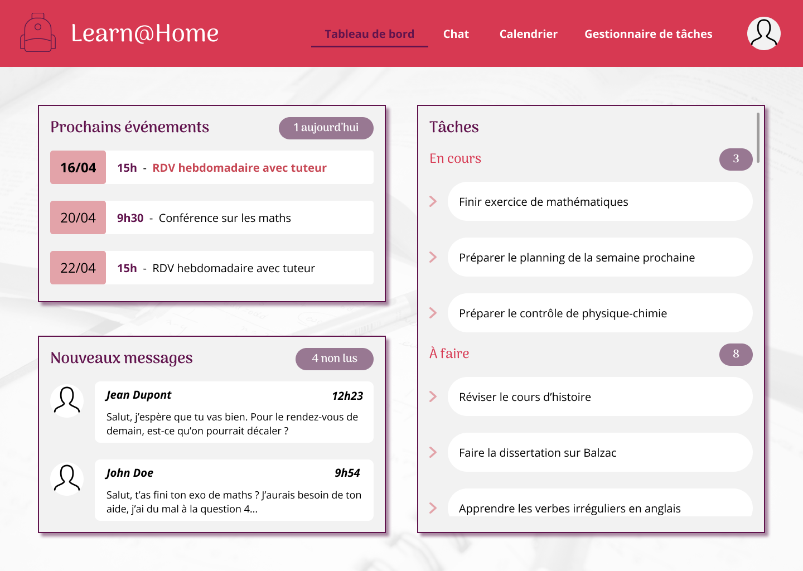

# Learn@Home

Learn@Home[^1] is an association that connects children with learning difficulties with volunteer tutors. Their goal is to allow students to have access to remote tutoring, to communicate directly from their website.

**Goal of this project**: Definition of client needs, and design creation.

## Load specifications

Each student registered on the site has an assigned volunteer tutor. The tutor supports the student in his learning, through short meetings scheduled each week. During these meetings, the tutor helps the student to complete his homework and to organize himself. 5 different pages are needed:
1. Login page
2. Homepage
3. Chat page
4. Calendar page
5. Task handling page

### Features

- Login page:
    * Allow student or tutor to log in.
    * Create a link to sign up.
    * Create a system for forgotten password.
- Homepage:
    * Recover informations from chat, calendar and task handling page (number of non-read messages, next events, task summary)
    * Access user profile (student or tutor).
- Chat page:
    * Create a system of instant chat.
    * Allow access to chat history.
    * Allow user to add or remove a contact.
    * Add profile picture of sender, date and time, and read indication to each send or received message.
- Calendar page:
    * Add calendar view and detailed event view.
    * Allow user to add or remove an event, see and update event details.
- Task handling page:
    * Allow student to add or remove a task for himself/herself, and see and update task details.
    * Allow tutor to add or remove a task for all of his/her students, and see and update task details.
    * Allow student to see a list of his/her finished tasks.
    * Allow tutor to see a list of student's finished tasks for all of his/her students.

### Kanban

For this project, the goal is to define the client needs first with user stories for each possible action. To do so, this [kanban](https://aureliane-g.notion.site/21637d7067fa4d73b0579d15246870cb?v=e58f9693b23240b3a29c130a7ce2fcc9) contains for each feature a user story, the acceptation criteria, and desktop and mobile designs (with their status, priority, and sprint).

### Website designs

The created desktop and mobile designs are available on [Figma](https://www.figma.com/file/tNhqmeOhPaLbmOJgcgHKeE/Learn%40Home).

[^1]: This is the 7th project of the "Front-end developer (JS - React)" training by OpenClassrooms.